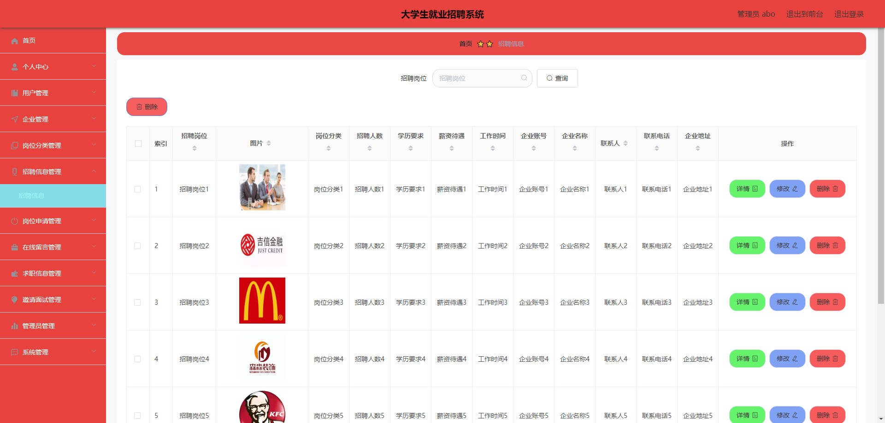
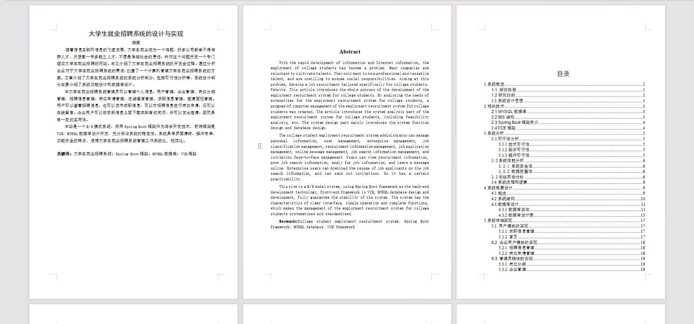

# 基于Springboot的大学生就业招聘系统

## Springboot-0047


## 技术栈

Springboot mybatisplus vue mysql maven


## 数据库表(11张)


## 功能介绍

```properties
系统管理员:可以管理个人信息，用户管理，企业管理，岗位分类管理，招聘信息管理，岗位申请管理，在线留言管理，求职信息管理，邀请面视管理。

用户:可以查看招聘信息，也可以发布求职信息，可以对招聘信息进行岗位申请，还可以在线留言。

企业用户:可以在求职信息上面下载求职者的简历，并可以发出邀请。
```


## 图片

### 前台


### 后台




### 


## 访问路径

### 前台

```properties
http://localhost:8080/springbootiv1oo/front/pages/login/login.html

账号 11
密码 123456
```

### 后台

```properties
http://localhost:8080/springbootiv1oo/admin/dist/index.html#/login

账号 abo
密码 abo
```


## 功能图


## 文档目录




## 打赏或交流


